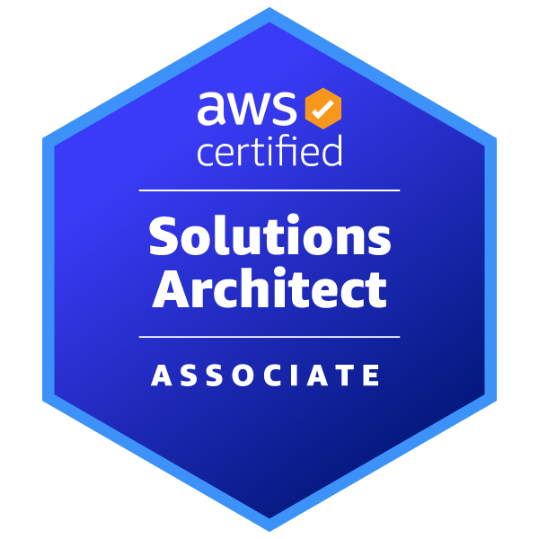

## About Me

From the very start of my tech journey, I found myself drawn to the art and science of building reliable systems in the cloud. As a DevOps and Site Reliability Engineer, I thrive at the intersection of automation, cloud architecture, and performance optimization. AWS has been my constant companion, enabling me to design, deploy, and scale systems that are as resilient as they are efficient.

My toolkit is shaped by years of hands-on experience: I wield Python for everything from quick scripts to robust automation, embrace the power of CI/CD to keep development flowing smoothly, and obsess over observability because understanding how systems behave in production is half the battle. Lately, I’ve been captivated by the potential of Generative AI to transform both development workflows and user experiences.

Among my proudest contributions are projects like [PocketFlow](https://github.com/The-Pocket/PocketFlow) and its [tutorial codebase](https://github.com/The-Pocket/PocketFlow-Tutorial-Codebase-Knowledge), where I explored model compression and knowledge distillation—pushing the boundaries of efficiency in AI.

What keeps me motivated is not just the technology, but the underlying philosophy of system design: the challenge of architecting solutions that are robust, elegant, and scalable in the unpredictable world of the cloud. Off the clock, you’ll find me geeking out over the latest in cloud performance, tuning generative models, or unwinding with the evocative tunes of Yorushika.

In short, I’m a cloud enthusiast, a performance chaser, a Gen AI explorer—and always searching for the next big idea to build or optimize.

## Certificates & Trainings
